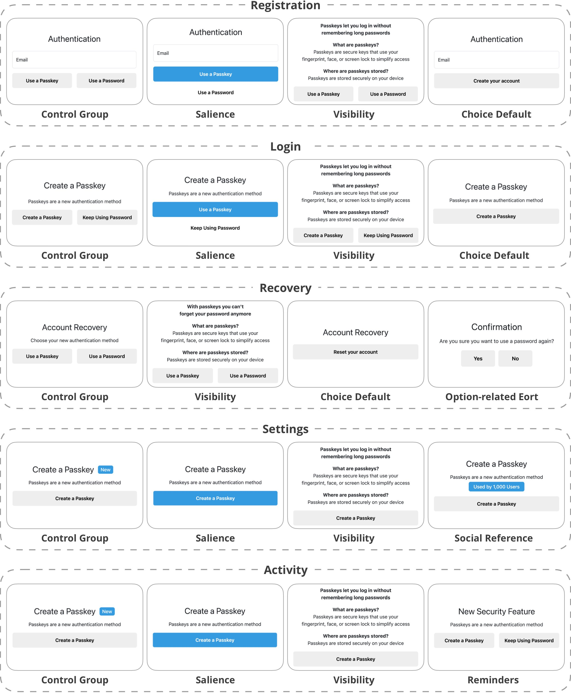

# Investigating the Effect of Digital Nudges on Passkey Adoption

This repository contains the materials for our study on how **digital nudges** influence users’ adoption of **passkeys** (FIDO2/WebAuthn). It includes the experimental implementation, per-nudge source files, data and R scripts for analysis, and a codebook.

> **TL;DR**
> We instrumented five touchpoints (registration, login, recovery, settings, activity). For each touchpoint we compared a control condition to three nudge variants. This repository provides everything needed to replicate the study and reproduce the statistical analysis.

---

## Table of Contents

1. [Study Overview](#study-overview)
2. [Source Code](#source-code)
3. [Statistical Analysis](#statistical-analysis)
3. [Codebook](#codebook)

---

## Study Overview

We targeted **five touchpoints** along a typical authentication journey where users could adopt passkeys:

* **Registration**
* **Login**
* **Recovery**
* **Settings**
* **Activity**

For each touchpoint, we compared a **control** condition against **three nudge conditions**. Figure 1 summarizes the experimental design across conditions.

<p align="center">
  
</p>

**Figure 1.** Overview of the five touchpoints and the four conditions (1x control, 3x nudges) per touchpoint.

---

## Source Code

Our implementation builds on:

* [`lbuchs/WebAuthn`](https://github.com/lbuchs/WebAuthn)
* [`PasskeyStudy/Availability`](https://github.com/PasskeyStudy/Availability) — see their [installation guide](https://github.com/PasskeyStudy/Availability?tab=readme-ov-file#installation)


In the following list, we reference the source code of each group.

### Registration

* Control: [`code/registration-control.php`](code/registration-control.php)
* Salience: [`code/registration-salience.php`](code/registration-salience.php)
* Visibility: [`code/registration-visibility.php`](code/registration-visibility.php)
* Choice default: [`code/registration-default.php`](code/registration-default.php)

### Login

* Control: [`code/login-control.php`](code/login-control.php)
* Salience: [`code/login-salience.php`](code/login-salience.php)
* Visibility: [`code/login-visibility.php`](code/login-visibility.php)
* Choice default: [`code/login-default.php`](code/login-default.php)

### Recovery

* Control: [`code/recovery-control.php`](code/recovery-control.php)
* Visibility: [`code/recovery-visibility.php`](code/recovery-visibility.php)
* Choice default: [`code/recovery-default.php`](code/recovery-default.php)
* Option-related effort: [`code/recovery-effort.php`](code/recovery-effort.php)

### Settings

* Control: [`code/settings-control.php`](code/settings-control.php)
* Salience: [`code/settings-salience.php`](code/settings-salience.php)
* Visibility: [`code/settings-visibility.php`](code/settings-visibility.php)
* Social reference: [`code/settings-social.php`](code/settings-social.php)

### Activity

* Control: [`code/activity-control.php`](code/activity-control.php)
* Salience: [`code/activity-salience.php`](code/activity-salience.php)
* Visibility: [`code/activity-visibility.php`](code/activity-visibility.php)
* Reminders: [`code/activity-reminders.php`](code/activity-reminders.php)

---

## Statistical Analysis

We conducted our analysis in **R**, calculating correlations and regression models between dependent and independent variables.

* Script: [`analysis/data_analysis.R`](analysis/data_analysis.R)
* Data: [`analysis/data.csv`](analysis/data.csv) and [`analysis/demographics.csv`](analysis/demographics.csv)

### Quick start

1. Open R (or RStudio) in the `analysis/` directory.
2. (Recommended) Use `renv` to restore package versions:
   ```r
   install.packages("renv")
   ```
3. Run:

   ```r
   source("data_analysis.R")
   ```
4. Outputs will be written to `analysis/output/`.

---

## Codebook

Prior to the user study, we conducted expert interviews to identify suitable nudges and their design. We outline the codebook of the interviews as follows.

| **Category (Nudge)**                   | **Codes**                                                                                                                                                                                                                             |
| -------------------------------------- | ------------------------------------------------------------------------------------------------------------------------------------------------------------------------------------------------------------------------------------- |
| **Translation**                        | Use familiar, user-centric vocabulary; define “passkey” briefly with a purpose-first approach; tailor wording to touchpoint expectations; avoid info dumps during ongoing tasks.                                                      |
| **Salience**                           | Make passkey setup the visually primary action (placement, size, contrast); de-emphasize the legacy password path; reduce competing elements near CTAs; preserve accessibility (contrast, focus order, screen-reader labels).         |
| **Visibility**                         | Provide brief, scannable benefits (security, speed, fewer resets); include “how it works” at point-of-need; avoid lengthy “password drawbacks” sections.                                                                              |
| **Phrasing (Framing)**                 | Frame outcomes concretely (fewer reset emails, less typing); align tone with user pain points (esp. recovery hassles); keep supportive rather than punitive.                                                                          |
| **Range / Composition (Option Order)** | Use predictable selection patterns (first in vertical lists, rightmost in horizontal); keep layouts consistent across flows; group modern methods (passkeys) distinctly from legacy options; when reordering, add explicit cues.      |
| **Choice Default**                     | Defaults should align with user expectations at that touchpoint (registration/login/recovery); always ensure a clear opt-out path.                                                                                                    |
| **Option Consequences**                | Avoid punitive outcomes for password use; micro-incentives are hard to operationalize in auth flows; prefer informational prompts and capability building over coercion.                                                              |
| **Effort**                             | Add small, transparent friction to password use (e.g., brief confirmation); avoid inserting friction mid-activity; keep switch steps clear and predictable.                                                                           |
| **Reminders**                          | Trigger contextually (e.g., after recovery or at natural pauses); cap frequency to prevent fatigue; include one-click setup from the reminder.                                                                                        |
| **Commitment Facilitation**            | Private pre-commitment may attract already-willing users; public commitments are impractical/privacy-sensitive in auth contexts.                                                                                                      |
| **Messenger Reputation**               | Using the company brand as “messenger” adds little beyond existing trust; celebrity endorsements conflate with social proof rather than true messenger effects.                                                                       |
| **Social Reference**                   | Use authentic adoption signals (counts/peer/org adoption); place near the primary CTA; ensure claims are verifiable and not inflated; prefer descriptive (“Many users in your org use passkeys”) over prescriptive (“Everyone does”). |
| **Empathy Instigation**                | Keep visuals subtle; emoji/meters are a poor fit for a binary adoption decision.                                                                                                                                                      |